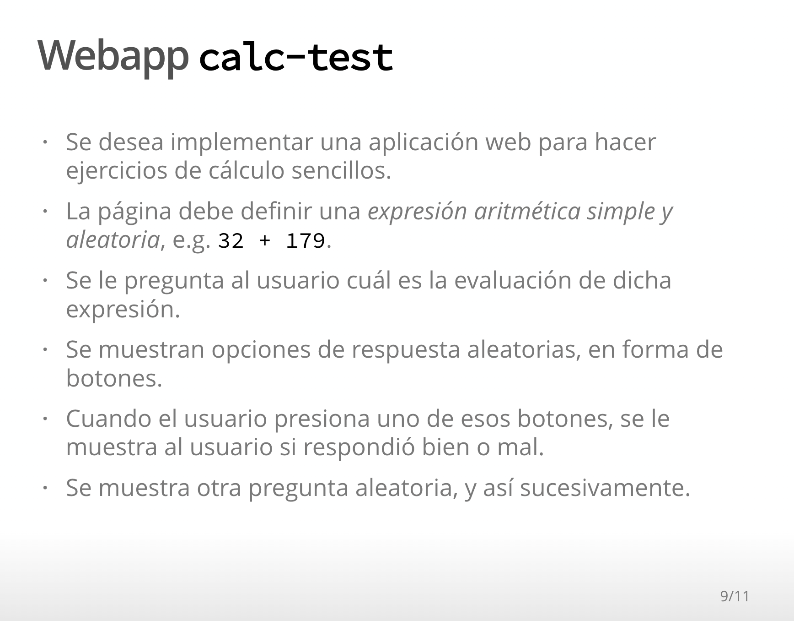
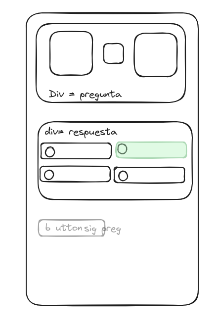
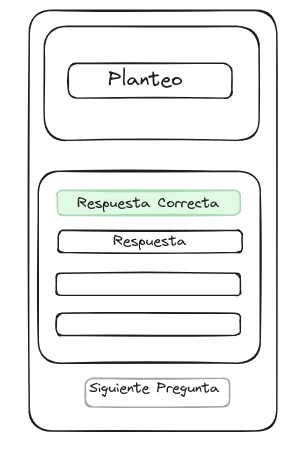

# calc-test_g3

 

  

    <h2 style="font-size: 22px; font-weight: bold;">Version 1</h2>
    
  

  

    <h2 style="font-size: 22px; font-weight: bold;">Version 2</h2>
    
  

 

Nuestra solucion consta de niveles que van aumentando a medida que se contesta correctamente.

Durante la implementación tuvimos un importante bloqueo con respecto a la operación divisoria y la generación de opciones correctas

 En la segunda version decidimos descartar la operacion como válida, pero una posible solución para la division podría ser definir una lista de divisores, del 1 al 20 por ejemplo, y utilizar uno de esos valores. 

También podrian ser utilizados como segundo operador de las multiplicaciones
